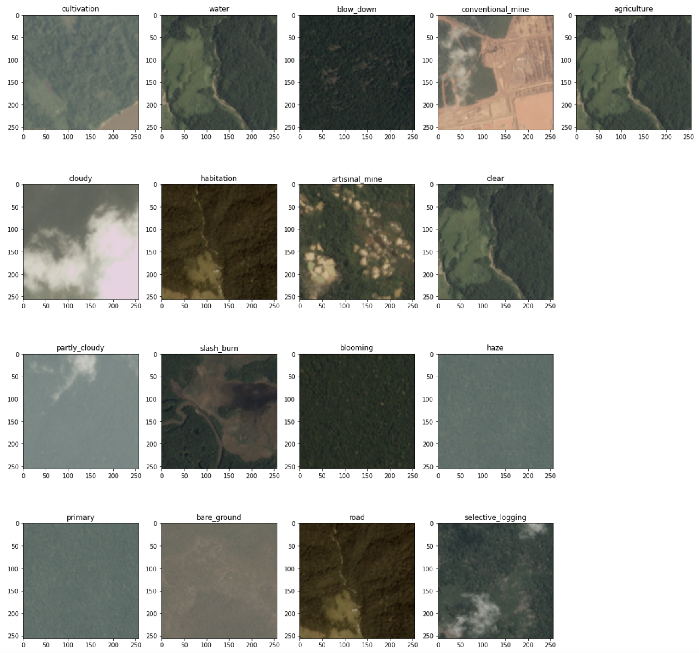

# Service Part 

Multilabel classification with planet-understanding-the-amazon-from-space [task](https://www.kaggle.com/competitions/planet-understanding-the-amazon-from-space/overview).



## API

The API is implemented on the HTTP protocol with the transfer of information in JSON format to
based on REST principles.

## Requests examples

#### 1. Get all planet image conditions

###### Request
```http request
GET planet/all_conditions
```
###### Response

```http request
200 OK
```

```json5
{
  "conditions": [ <list of all conditions> ],
}
```

#### 2. Image conditions classes prediction

###### Request
```http request
POST planet/predict/image

Content-Type: image/jpeg
<binary-code-of-jpeg-encoded-image-here>
```
###### Response

```http request
200 OK
```

```json5
{
  "conditions": [
    "primary",
    "clean"
  ]
}
```

#### 3. Image conditions probabilities prediction

###### Request
```http request
POST planet/predict_proba/image

Content-Type: image/jpeg
<binary-code-of-jpeg-encoded-image-here>
```
###### Response

```http request
200 OK
```

```json5
{
  "conditions": {
    'condition1': probability1,
    ...
    'conditionN': probabilityN
  }
}
```

## Service launch

##### Steps to launch service locally
1. Run ```make init_dvc``` + ```make download_weights```. to download current model weights
2. Simple launch with python  
```python3 -m uvicorn app:app --host='0.0.0.0' --port=$(APP_PORT)```, 
where ```APP_PORT``` - your port
3. Launch with docker (build Dockerfile)
<br />```make build DOCKER_IMAGE=$(DOCKER_IMAGE) DOCKER_TAG=$(DOCKER_TAG)``` <br />DOCKER_IMAGE - docker image name, DOCKER_TAG - docker image tag
<br />
```
    docker run \
    -d \
    -p 0.0.0.0:5000 \
    --name=$(CONTAINER_NAME) \
    ${DOCKER_IMAGE}
```
CONTAINER_NAME - container name

## Tests launch
 ```PYTHONPATH=. pytest .```
